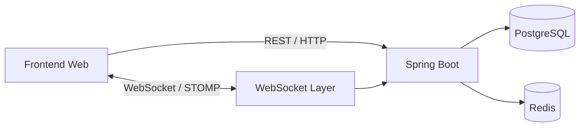

# ChatWeb

ChatWeb es un proyecto de mensajería web orientado inicialmente a comunicación entre usuarios mediante chats **individuales** y **grupales**.

La primera etapa se concentra en construir un backend sólido con **Spring Boot**, comunicación en tiempo real mediante **WebSocket/STOMP**, persistencia en **PostgreSQL** y soporte de **Redis** para información efímera como presencia, escritura y distribución de eventos.

> Estado actual: el backend ya fue inicializado, el modelo de base de datos fue diseñado con pgModeler y el frontend aún no ha sido creado.

## Alcance V1

La primera versión contempla:

- Registro y gestión de usuarios.
- Chat individual (`DIRECT`).
- Chat grupal (`GROUP`).
- Miembros por chat.
- Roles de grupo: `OWNER`, `ADMIN` y `MEMBER`.
- Envío y persistencia de mensajes.
- Respuesta a mensajes.
- Registro de mensajes leídos.
- Silenciar y archivar chats por usuario.
- Comunicación en tiempo real mediante WebSocket/STOMP.
- Redis para estado efímero y futura distribución entre instancias.

Fuera del alcance de esta primera etapa:

- Multiempresa.
- Archivos adjuntos.
- Audio y video.
- Reacciones.
- Llamadas.
- Kafka.
- Microservicios.

## Stack

### Backend

- Java 25
- Spring Boot 4.1.1
- Spring Web MVC
- Spring WebSocket / STOMP
- Spring Security
- OAuth2 Resource Server / JWT
- Spring Validation
- Spring Data JPA
- Spring Data Redis
- Flyway
- PostgreSQL
- Lombok
- Testcontainers
- Gradle

### Base de datos

- PostgreSQL 18
- pgModeler 1.2.3

### Frontend

Pendiente de definición e implementación.

## Arquitectura propuesta



PostgreSQL será la **fuente de verdad** para usuarios, chats, membresías, mensajes y lecturas.

Redis no reemplaza PostgreSQL. Se utilizará para información temporal y de tiempo real, por ejemplo:

- Usuarios conectados.
- Indicador "está escribiendo".
- Sesiones o datos de presencia con TTL.
- Pub/Sub cuando existan varias instancias del backend.

## Estructura actual

```text
ChatWeb/
├── chatweb-backend/
│   ├── src/
│   │   ├── main/
│   │   │   ├── java/
│   │   │   └── resources/
│   │   └── test/
│   ├── build.gradle
│   ├── settings.gradle
│   └── gradlew
├── database/
│   ├── chatweb.dbm
│   └── chatweb.sql
└── README.md
```

## Estado del backend

Actualmente el backend contiene la inicialización base del proyecto Spring Boot y las dependencias principales.

El archivo `application.yaml` aún contiene únicamente el nombre de la aplicación. La configuración de PostgreSQL, Redis, seguridad y Flyway se implementará durante el desarrollo.

## Modelo de datos V1

Las tablas principales son:

- `users`
- `chat`
- `user_chat`
- `messages`
- `message_read`

El diseño soporta conversaciones directas y grupales usando una sola entidad `chat`.

## REST vs WebSocket

Se seguirá una separación clara:

**REST** para operaciones consultivas o administrativas, como usuarios, creación de chats, miembros e historial.

**WebSocket/STOMP** para eventos en tiempo real, como nuevos mensajes, ediciones, eliminaciones, lectura, presencia y escritura.

Más detalle en [docs/API_WEBSOCKET.md](docs/API_WEBSOCKET.md).

## Documentación

- [Arquitectura](docs/ARCHITECTURE.md)
- [Base de datos](docs/DATABASE.md)
- [API REST y WebSocket](docs/API_WEBSOCKET.md)
- [Roadmap](docs/ROADMAP.md)

## Ejecución

Desde `chatweb-backend`:

### Windows

```bash
gradlew.bat bootRun
```

### Linux / macOS / Git Bash

```bash
./gradlew bootRun
```

La ejecución completa requerirá configurar previamente PostgreSQL y Redis en `application.yaml` o mediante variables de entorno.

## Objetivo técnico

La aplicación comenzará como un **monolito modular**. El objetivo es mantener límites claros entre autenticación, usuarios, chats, mensajes, WebSocket, presencia y componentes compartidos, evitando introducir microservicios antes de que exista una necesidad real de escalabilidad o despliegue independiente.
