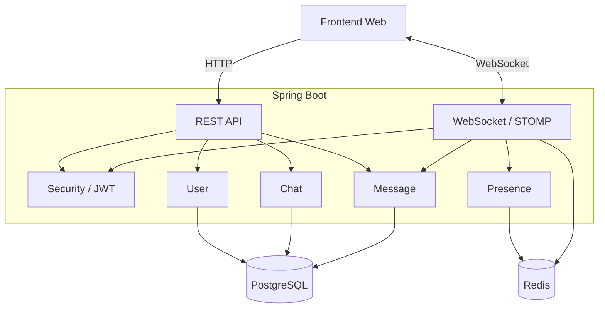
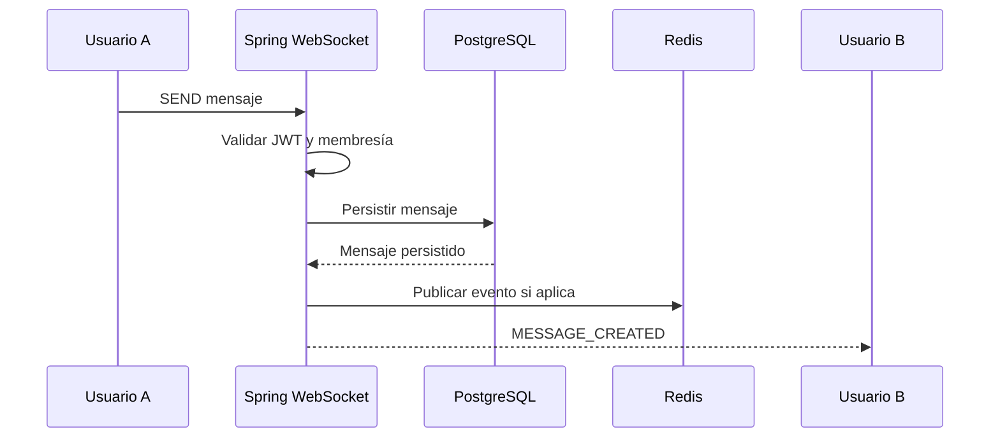
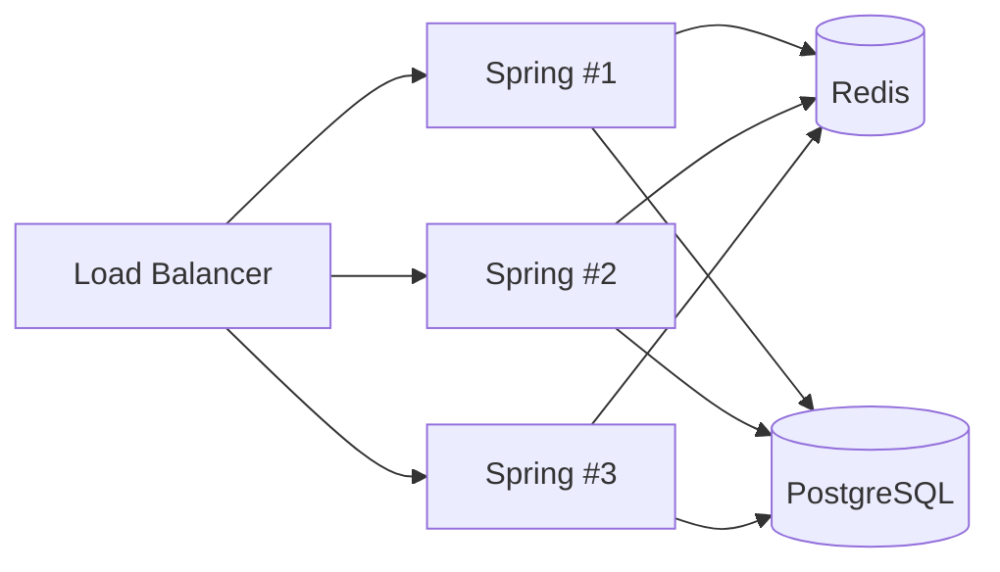

# Arquitectura de ChatWeb

## 1. Objetivo

ChatWeb busca ofrecer una base de mensajería empresarial reutilizable y escalable, comenzando con chat individual y grupal.

La V1 se implementará como **monolito modular**, manteniendo responsabilidades separadas dentro de una sola aplicación Spring Boot.

## 2. Principios

- PostgreSQL es la fuente de verdad.
- WebSocket se mantiene conectado mientras el usuario usa la aplicación.
- No se abre un WebSocket por conversación.
- Una sola conexión puede manejar múltiples chats.
- REST y WebSocket tienen responsabilidades diferentes.
- Redis almacena información efímera; no sustituye la persistencia de mensajes.
- Kafka no forma parte de la V1.

## 3. Arquitectura general



## 4. Módulos previstos

La estructura interna propuesta es:

```text
com.chatweb.chatweb_backend
├── auth
├── user
├── chat
├── message
├── websocket
├── presence
├── security
└── shared
```

### auth

Responsable del inicio de sesión, generación/renovación de tokens y contexto del usuario autenticado.

### user

Gestión de usuarios y consultas necesarias para iniciar conversaciones.

### chat

Creación de chats directos y grupales, miembros, roles, archivado y silenciado.

### message

Persistencia, consulta, edición, eliminación lógica, respuestas y lecturas.

### websocket

Configuración STOMP, interceptores, destinos y publicación de eventos en tiempo real.

### presence

Estado online/offline, heartbeat, TTL e indicador de escritura mediante Redis.

### security

Configuración de Spring Security, JWT, autorización REST y autorización de frames STOMP.

### shared

Excepciones, respuestas comunes, utilidades, auditoría básica y componentes compartidos.

## 5. Flujo de envío de mensajes



El mensaje se persiste antes de notificarse como creado.

## 6. WebSocket

La conexión se abrirá cuando el usuario ingrese a la aplicación autenticada y permanecerá activa mientras utilice el sistema.

No se conectará únicamente al enviar o recibir mensajes, porque el servidor necesita una conexión activa para entregar eventos espontáneos.

Se utilizará STOMP sobre WebSocket para organizar destinos y suscripciones.

Destinos propuestos:

```text
/app/chats/{chatId}/messages
/app/chats/{chatId}/read
/app/chats/{chatId}/typing

/user/queue/messages
/user/queue/notifications

/topic/chats/{chatId}
```

Los destinos definitivos pueden ajustarse durante la implementación.

## 7. Redis

Redis se utilizará inicialmente para:

- Presencia de usuarios.
- TTL para detectar desconexiones abruptas.
- Indicador de escritura.
- Caché efímera cuando aporte valor.
- Pub/Sub cuando el backend escale horizontalmente.

Ejemplo conceptual:

```text
presence:user:{userId}
typing:chat:{chatId}:user:{userId}
```

Los mensajes de negocio no se almacenarán únicamente en Redis.

## 8. Escalamiento futuro

Con una sola instancia de Spring Boot, el broker simple de STOMP puede ser suficiente para comenzar.

Cuando existan varias instancias:



Kafka solo se evaluará si aparecen necesidades como procesamiento asíncrono durable, analítica, indexación, notificaciones desacopladas o integraciones independientes.
