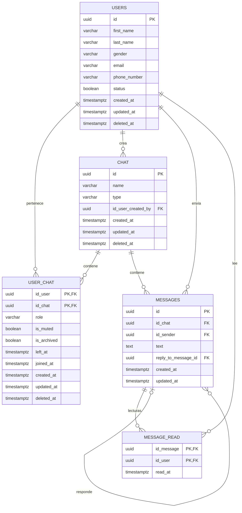

# Base de datos

## 1. Estado actual

El modelo se encuentra en:

```text
database/chatweb.dbm
database/chatweb.sql
```

El archivo `.dbm` corresponde al modelo de pgModeler y `chatweb.sql` contiene el SQL exportado.

Tecnologías actuales:

- PostgreSQL 18
- pgModeler 1.2.3
- UUID como identificador principal

## 2. Modelo V1



## 3. Reglas principales

### Chat

`chat.type` admite:

```text
DIRECT
GROUP
```

La restricción actual es:

```sql
CHECK (type IN ('DIRECT', 'GROUP'))
```

### Membresía

`user_chat.role` admite:

```text
OWNER
ADMIN
MEMBER
```

con `MEMBER` como valor por defecto.

La PK compuesta:

```text
(id_user, id_chat)
```

impide que un usuario quede asociado dos veces al mismo chat.

### Mensajes

Cada mensaje pertenece a un chat y tiene un remitente.

`reply_to_message_id` permite responder a otro mensaje de forma opcional.

La relación entre `messages` y `user_chat` debe garantizar que el remitente pertenece al chat donde intenta publicar.

### Lecturas

`message_read` utiliza:

```text
PRIMARY KEY (id_message, id_user)
```

por lo que una lectura de un mensaje por usuario solo se registra una vez.

## 4. Índices

PostgreSQL crea índices automáticamente para PK y restricciones UNIQUE.

Por tanto ya quedan indexados automáticamente:

- `users.id`
- `users.email`
- `users.phone_number`
- `chat.id`
- `messages.id`
- `user_chat(id_user, id_chat)`
- `message_read(id_message, id_user)`

Los índices manuales deben responder a patrones reales de consulta.

Para el historial de mensajes, el índice objetivo es:

```sql
CREATE INDEX idx_messages_chat_created_at
ON messages (id_chat, created_at DESC);
```

porque la consulta habitual será equivalente a:

```sql
SELECT *
FROM messages
WHERE id_chat = :chatId
ORDER BY created_at DESC
LIMIT 50;
```

## 5. Observaciones sobre el SQL exportado actual

El SQL versionado actualmente todavía representa un modelo en evolución. Antes de convertirlo en la migración inicial definitiva de Flyway conviene revisar, como mínimo:

- Que `idx_messages_chat_created_at` realmente use `(id_chat, created_at DESC)`.
- Si la V1 aplicará soft delete a mensajes, agregar `messages.deleted_at`.
- Mantener consistente el orden de la FK compuesta entre `messages` y `user_chat`.

Una vez creada `V1__initial_schema.sql`, no debe editarse después de haber sido aplicada en entornos compartidos; los cambios posteriores deberán ir en nuevas migraciones.

## 6. Flyway

Flujo recomendado:

```text
pgModeler
   ↓
modelo aprobado
   ↓
SQL inicial
   ↓
V1__initial_schema.sql
   ↓
Flyway
   ↓
PostgreSQL
```

Ejemplo futuro:

```text
V1__initial_schema.sql
V2__add_message_soft_delete.sql
V3__add_attachments.sql
V4__add_company_support.sql
```
